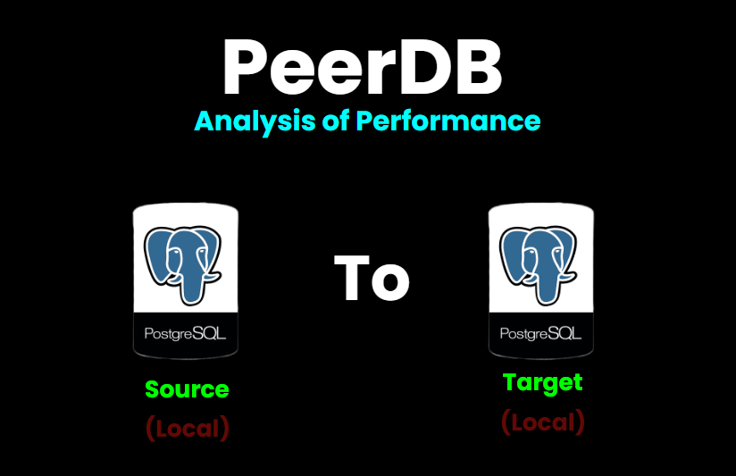

# PeerDB - Pipeline CDC (Change Data Capture) dan Analisis Performa



PeerDB adalah platform CDC (Change Data Capture) real-time yang memungkinkan replikasi data dari database sumber ke database target.


## 📁 Struktur Proyek

```
peerdb/
├── docker-compose.yml          # Konfigurasi container PeerDB
├── run-peerdb.sh               # Script untuk menjalankan PeerDB
├── quickstart_prepare_peers.sh # Script setup database
├── insert.ps1                  # Script stress test INSERT
├── monitoring.ps1             # Script monitoring pipeline
├── testing-results/           # Folder hasil testing dan logs
└── README.md                  # Dokumentasi ini
```

## 🚀 Langkah Instalasi

### 1. Clone Repository

```bash
git clone https://github.com/khoirulamars/peerdb-cdc-psql-psql
cd peerdb
```

### 2. Pastikan Docker Berjalan

```powershell
docker --version
docker-compose --version
```

### 3. Setup 
####  Jalankan PeerDB Stack

```powershell
# Menggunakan Docker Compose
docker compose up -d

# Atau menggunakan script run-peerdb.sh ( menggunakan WSL/Linux)
./run-peerdb.sh
```

**Output yang diharapkan:**
```
[+] Running 11/11
 ✔ Container catalog                    Healthy
 ✔ Container peerdb-server              Started
 ✔ Container temporal                   Started
 ✔ Container peerdb-ui                  Started
 ✔ Container flow-worker                Started
 ✔ Container flow_api                   Started
 ...
```

#### Verifikasi Container Status

```powershell
docker ps
```

Pastikan semua container dalam status `Up` dan `healthy`.

#### Setup Database Source

```bash
./quickstart_prepare_peers.sh
```

Pastikan tidak terjadi error.


## 🔄 Membuat CDC Mirror

1. **Akses UI**: Buka http://localhost:3000
2. **Create Peer**: 
   - Klik "Add Peer"
   - **Source Peer**:
     - Name: `postgres_source`
     - Type: PostgreSQL
     - Host: `catalog`
     - Port: `5432`
     - Database: `source`
     - Username: `postgres`
     - Password: `postgres`
   - **Target Peer**:
     - Name: `postgres_target`
     - Type: PostgreSQL
     - Host: `catalog`
     - Port: `5432`
     - Database: `target`
     - Username: `postgres`
     - Password: `postgres`

3. **Create Mirror**:
   - Klik "Create Mirror"
   - Source: `postgres_source`
   - Target: `postgres_target`
   - Tables: Pilih `customers`, `products`, `orders`
   - Mirror Name: `postgres_to_postgres_mirror`

4. **Start Replication**: Klik "Start" pada mirror yang telah dibuat

## 🧪 Testing Pipeline

### Jalankan Stress Test INSERT

```powershell
# Test basic (100 records, batch 10)
.\insert.ps1 -RecordCount 100 -BatchSize 10 -ShowProgress

# Test dengan parameter custom
.\insert.ps1 -RecordCount 1000 -BatchSize 50 -DelayBetweenBatches 2 -ShowProgress

# Test performa tinggi
.\insert.ps1 -RecordCount 5000 -BatchSize 500 -DelayBetweenBatches 1
```

**Parameter yang tersedia:**
- `-RecordCount`: Jumlah record yang akan diinsert (default: 5000)
- `-BatchSize`: Ukuran batch per transaksi (default: 500)
- `-DelayBetweenBatches`: Delay antar batch dalam detik (default: 1)
- `-ShowProgress`: Menampilkan progress detail

**Output yang diharapkan:**
```
[17:41:09] PeerDB CDC Pipeline INSERT Stress Test
[17:41:09] Test ID: 2025-09-01-17-41-09
[17:41:09] Target Records: 100
[17:41:09] Batch Size: 10
[17:41:09] Success Rate: 100%
[17:41:09] Throughput: 1.04 operations/second
```

### File Log yang Dihasilkan

- **Stress Test Log**: `testing-results/peerdb-stress-test-[timestamp].log`
- **Resource Usage Log**: `testing-results/peerdb-resource-usage-[timestamp].log`

## 📊 Monitoring

### Jalankan Script Monitoring

```powershell
.\monitoring.ps1
```

**Pilihan monitoring:**
- **[A] Auto-select**: Otomatis memilih file log terbaru
- **[M] Manual**: Pilih file log secara manual
- **[Q] Quit**: Keluar dari monitoring

### Informasi yang Dipantau

1. **System Resource Usage**: CPU, Memory, Container stats
2. **Server Health Check**: Status koneksi database
3. **Table Statistics**: Jumlah row, ukuran tabel source vs target
4. **Flow Analysis**: Status CDC replication
5. **Operations Analysis**: INSERT/UPDATE/DELETE operations
6. **Container Health**: Status semua container Docker
7. **Performance Summary**: Ringkasan performa pipeline
8. **Database Metrics**: Metrik performa database
9. **Flow Health**: Kesehatan konfigurasi CDC
10. **Analysis Summary**: Rekomendasi berdasarkan analisis


## 🐛 Troubleshooting

### 1. Container Tidak Start

```powershell
# Cek status container
docker ps -a

# Cek logs container bermasalah
docker logs <container_name>

# Restart container
docker restart <container_name>
```

### 2. Database Connection Error

```powershell
# Test koneksi ke catalog
docker exec catalog psql -U postgres -d postgres -c "SELECT 1;"

# Cek apakah database source/target sudah dibuat
docker exec catalog psql -U postgres -d postgres -c "\l"
```

### 3. UI Tidak Accessible

```powershell
# Cek status container UI
docker ps | grep peerdb-ui

# Restart container UI
docker restart peerdb-ui

# Cek logs UI
docker logs peerdb-ui
```

### 4. CDC Replication Tidak Berjalan

1. **Cek di PeerDB UI**: Pastikan mirror sudah dibuat dan started
2. **Cek WAL Level**: Database PostgreSQL harus menggunakan `wal_level = logical`
3. **Cek Replication Slots**: 
   ```sql
   SELECT * FROM pg_replication_slots;
   ```

### 5. Reset Complete Environment

```powershell
# Stop semua container
docker compose down

# Hapus volume (WARNING: Akan menghapus semua data)
docker compose down -v

# Restart clean
docker compose up -d
```

## 🔄 Workflow CDC

1. **Data Insert** ke database source
2. **PostgreSQL WAL** menangkap perubahan
3. **PeerDB Flow Worker** membaca WAL
4. **Temporal Workflow** mengatur replikasi
5. **Data Replicated** ke database target
6. **Monitoring** melacak status dan performa

## 📞 Support

Jika mengalami masalah:

1. Jalankan monitoring script untuk diagnosis
2. Cek logs di folder `testing-results/`
3. Periksa status container dengan `docker ps`
4. Akses PeerDB UI untuk visual monitoring

---
